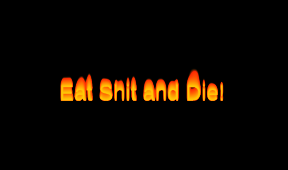

# Fire Effect

A JavaScript fire effect implemented using canvas



Live version [here](https://victorribeiro.com/fireEffect)

## About

Did you ever asked someone out and later found out that they were laughing about that with their friends? Did you ever got reject after a code interview where you had to implement a whole system over a period of a week, with no feedback on what you got wrong whatsoever? Did you ever shared a project online and people start picking on the smallests things just to piss you off? Well my friend, this is the tool for you. Send a special creative "thank you" note lit on fire and be happy. 

## How to use

Send the link to someone passing a message parameter:

```html
https://victorribeiro.com/fireEffect?message=Hi my friend
```


## Algorithm

[https://web.archive.org/web/20160418004150/http://freespace.virgin.net/hugo.elias/models/m_fire.htm](https://web.archive.org/web/20160418004150/http://freespace.virgin.net/hugo.elias/models/m_fire.htm)
